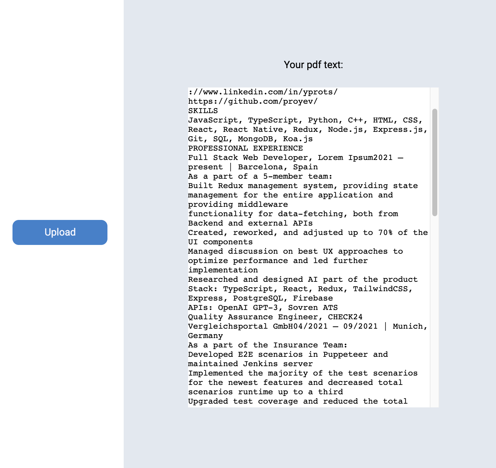

## Preview

    

## To get started

1. `git clone https://github.com/proyev/pdf-parser`
2. `cd pdf-parser`
3. `npm i`
4. `npm start`
5. Go to http://localhost:8000/
6. Start uploading

## Built with

* Vanilla JS, HTML, CSS
* [Express](https://expressjs.com/)
* [Express Fileupload](https://www.npmjs.com/package/express-fileupload)
* [PDF-Parse](https://www.npmjs.com/package/pdf-parse)

## Considerations

Given more time the following would be included:

- Test coverage
- PDF upload only when being fully loaded - right now the corresponding event is not being triggered for unknown reason
- Drag and drop functionality, still with pure Vanilla JS, HTML & CSS
